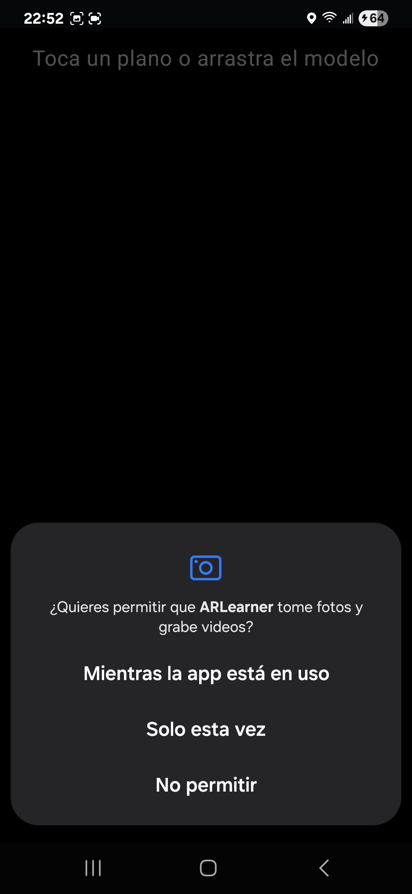
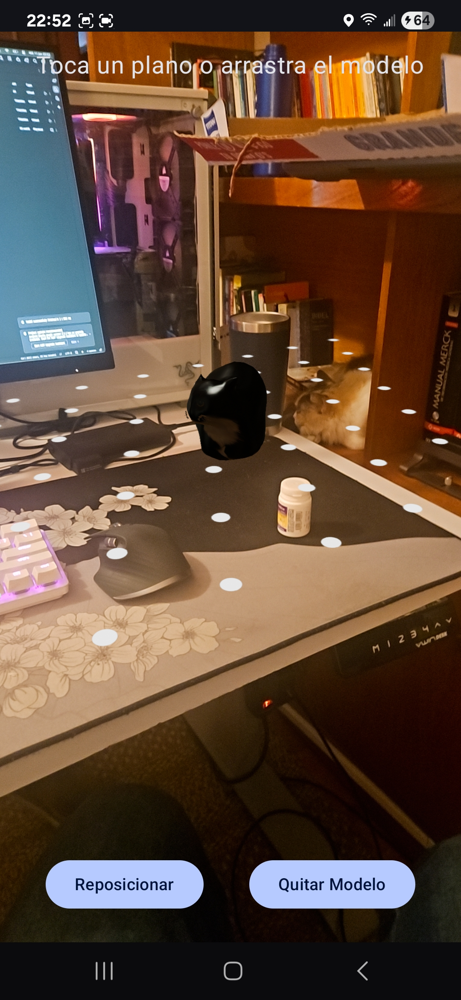
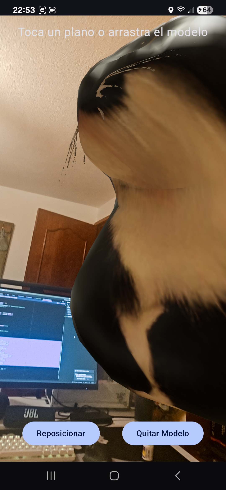
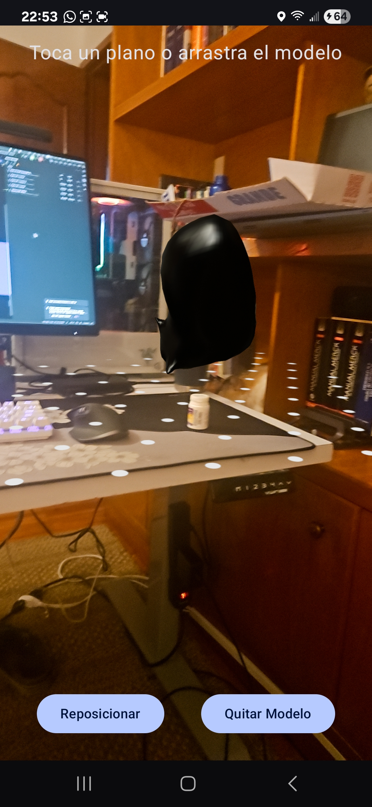

#Visor Interactivo de Modelos 3D

`Visor Interactivo de Modelos 3D` es una aplicación Android nativa con Jetpack Compose y SceneView que demuestra una experiencia de Realidad Aumentada interactiva. Permite a los usuarios colocar un modelo 3D en su entorno, escuchar un sonido al colocarlo y manipularlo con gestos táctiles (mover, rotar, escalar).

## 🖼️ Capturas de Pantalla
<!-- del folder images -->
### inicio de la app

### Permiso de cámara

### Detección de plano

### Modelo 3D interactivo
 

---

## 🚀 Configuración y Ejecución

1. **Clona** el repositorio en tu máquina local.
2. **Abre** el proyecto con Android Studio (versión Flamingo o superior).
3. **Espera** a que Gradle sincronice las dependencias.
4. **Conecta un dispositivo físico compatible con ARCore** (los emuladores no suelen funcionar). Asegúrate de que tenga los "Servicios de Google Play para RA" instalados.
5. **Ejecuta** la aplicación (▶️) en tu dispositivo.

---

## 🛠️ Desafíos Técnicos y Soluciones

Durante el desarrollo se superaron varios retos clave:

* **Gestión de Gestos en AR:** El principal desafío fue capturar los toques del usuario sin que entraran en conflicto con los controles de cámara de la escena AR. Tras varios intentos (con `Modifier.pointerInput` y `onSceneTouch`), la solución definitiva fue usar el listener de alto nivel **`onGestureListener`** que provee `sceneview`. Esto permitió diferenciar limpiamente entre un toque para colocar (`onSingleTapConfirmed`) y un arrastre para mover (`onScroll`).
* **Artefactos Visuales (El "Cubo"):** Al mover el modelo, aparecía un cubo a su alrededor. Este cubo era una "ayuda visual de transformación" que el `onGestureListener` activa por defecto. La solución fue implementar un manejo correcto del ciclo de vida de las  **anclas de ARCore** , asegurando **desprender (`detach`) el ancla vieja** cada vez que se asignaba una nueva durante el arrastre. Esto eliminó los glitches visuales.
* **Compatibilidad de API:** Nos encontramos con errores de compilación como `Type mismatch` y `Unresolved reference`. Esto se debió a las diferencias entre versiones de la librería `sceneview`. Se solucionó analizando los errores y aplicando soluciones idiomáticas de Kotlin, como el uso de `let` para manejar tipos nulables y la importación de las clases correctas.

---

## 📚 Dependencias Principales

El proyecto utiliza un stack moderno de desarrollo para Android y AR:

| Dependencia                          | Propósito                                                                                                           |
| :----------------------------------- | :------------------------------------------------------------------------------------------------------------------- |
| `libs.arsceneview`                 | **SceneView:**La librería principal que abstrae ARCore y el motor de renderizado 3D (Filament).                     |
| `libs.androidx.compose.*`          | **Jetpack Compose:**El kit de herramientas para construir toda la interfaz de usuario de forma nativa y declarativa. |
| `libs.androidx.navigation.compose` | **Navigation Compose:**Para gestionar la navegación entre las pantallas de la aplicación.                          |
| `libs.kotlinx.serialization.json`  | **Kotlinx Serialization:**Librería para convertir objetos Kotlin a formato JSON y viceversa.                        |
| `libs.androidx.core.ktx`, etc.     | **Android KTX & Jetpack Core:**Funcionalidades base y extensiones de Kotlin para el desarrollo en Android.           |
| `testImplementation`, etc.         | **Librerías de Testing:**Para pruebas unitarias, de instrumentación y herramientas de depuración.                 |
